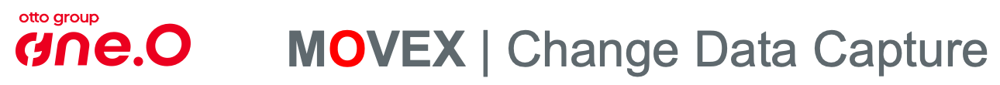

# Track changes in relational databases and transfer them to Kafka 

This product captures data change events (Insert/Update/Delete) in relational databases using database triggers and immediately transfers the data changes to a Kafka event hub.

The full documentation of this product can be found here:
- HTML: https://osp-silver.gitlab.io/oss/movex-cdc/movex-cdc.html
- PDF: https://osp-silver.gitlab.io/oss/movex-cdc/movex-cdc.pdf

## Supported database systems
- <b>Oracle</b> Oracle databases with Release 12.1 and higher
- <b>SQLite</b> The additional implementation for SQLite ensures that the product remains database independent.

## Usage
MOVEX Change Data Capture is available as a comprehensive [Docker image](https://hub.docker.com/r/ottogroupsolutionproviderosp/movex-cdc). 

## Quick start demo
Establish change data capture on Oracle DB including the event transfer to Kafka within 10 minutes. 
[Here you find the how-to guide to quickly get up and running.](https://osp-silver.gitlab.io/oss/movex-cdc/movex-cdc_demo.html)

## Releases
Production-ready releases are tagged with release number and can be pulled from Docker hub by: 
`docker pull ottogroupsolutionproviderosp/movex-cdc:1.7.0`

The current production-ready release is also tagged with `:latest` and can be pulled without a tag by: 
`docker pull ottogroupsolutionproviderosp/movex-cdc`

The latest build of the development master branch is available by: 
`docker pull registry.gitlab.com/osp-silver/oss/movex-cdc:master`

## Release notes
[See CHANGELOG.md](CHANGELOG.md)

## License / Support
MOVEX Change Data Capture is a product of the Otto Group One.O GmbH. 
This product can be used under the terms and conditions of [GPL 3](https://gitlab.com/osp-silver/oss/movex-cdc/-/blob/master/LICENSE). 
One.O is the IT service provider of the Otto Group, formerly known as Otto Group Solution Provider (OSP) GmbH. 
If you are interested in commercial support please reach out to [movex-cdc@osp.de](mailto:movex-cdc@osp.de). 

## Roadmap
The tool has been developed independently of a particular database system.
First implementations were for SQLite and Oracle with focus on production use for Oracle Enterprise Edition with Partitioning option.
 
Further planned implementations include:
- Production readiness for Oracle Standard Edition / EE without Partitioning Option
- Adaptation for PostgreSQL and MS SQL Server, but only if there are significant advantages compared to the existing solution [Debezium](https://debezium.io)

## Project status
It is already used in production with Oracle databases.
Further development is ongoing.

## Further resources
- [Video recording of JUG Saxony meeting on this topic (German) ](https://vimeo.com/705639939)