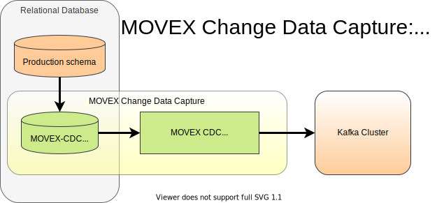

# MOVEX Change Data Capture: track changes in relational databases and transfer them to Kafka

This product captures data change events (Insert/Update/Delete) in relational databases by database triggers and immediately transfers the data changes to a Kafka event hub.

The full documentation of this product you may find here:
- HTML: https://otto-group-solution-provider.gitlab.io/movex-cdc/movex-cdc.html
- PDF: https://otto-group-solution-provider.gitlab.io/movex-cdc/movex-cdc.pdf

## Supported database systems
- <b>Oracle</b> Oracle databases with Release 12.1 and higher
- <b>SQLite</b> The aditional implementation for SQLite ensures that the product remains database independent.

## Usage
MOVEX Change Data Capture is offered as one single compact Docker image. 

## Quick start demo
Establish change data capture on Oracle DB including event transfer to Kafka within 10 minutes. 
[Here you find the howto guide to quickly get up and running.](https://otto-group-solution-provider.gitlab.io/movex-cdc/movex-cdc_demo.html)

## Releases
Production-ready releases are tagged with release number and can be pulled from Docker hub by: 
`docker pull ottogroupsolutionproviderosp/movex-cdc:1.7.0`

The current production-ready release is also tagged with `:latest` and can by pulled without a tag by: 
`docker pull ottogroupsolutionproviderosp/movex-cdc`

The latest build of the development master branch is available by: 
`docker pull registry.gitlab.com/otto-group-solution-provider/movex-cdc:master`

## Release notes
[See here](https://gitlab.com/otto-group-solution-provider/movex-cdc/-/blob/master/doc/release_notes.md)

## Support
If you have bug reports or questions please file an issue inside the product or mail to movex-cdc@osp.de.

## Roadmap
The tool has been developed independently of a particular database system.
First implementations have been for SQLite and Oracle with focus on productive usage for Oracle Enterprise Edition with Partitioning Option.
 
Further planned implementations are:
- Production readyness for Oracle Standard Edition / EE without Partitiong Option
- Adaptation for PostgreSQL and MS SQL Server, but only if there will be significant advantages compared to the existing solution [Debezium](https://debezium.io)

## License
This product can be used under the terms and conditions of [GPL 3](https://gitlab.com/otto-group-solution-provider/movex-cdc/-/blob/master/LICENSE).

## Project status
It is already used in production with Oracle databases.
Further development takes place.